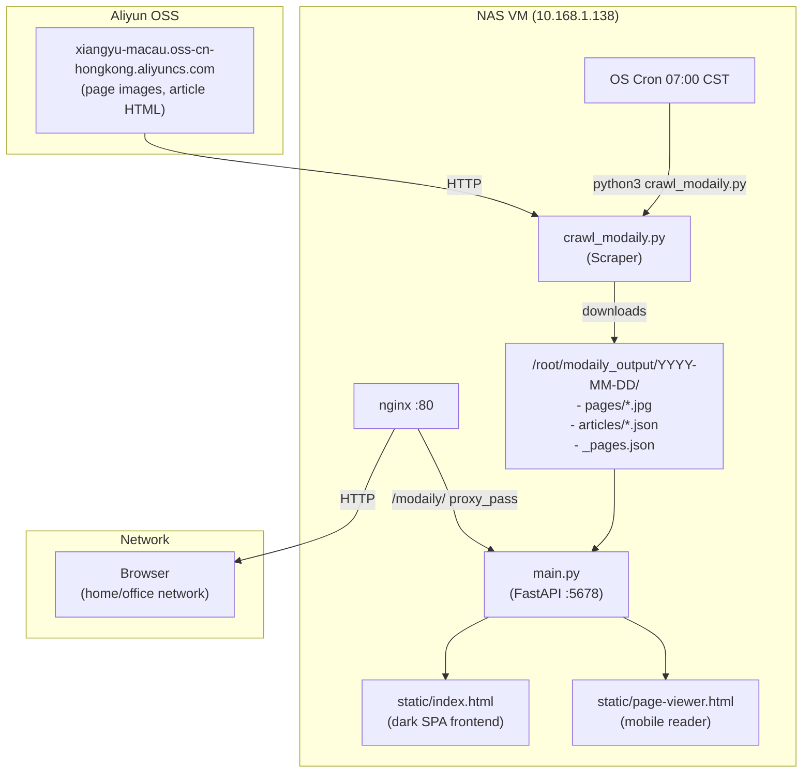

# 澳門日報 (Macau Daily News) 本地瀏覽系統


A self-hosted newspaper browsing system for **澳門日報 (Macau Daily News)** — scrapes daily newspaper editions (page scans, articles, metadata) and serves them via a FastAPI backend with a dark-themed SPA frontend.

**Features:**
- 📰 **Daily scraping** — automated daily crawl of all pages and articles
- 🖼️ **Page image viewer** — high-res newspaper page scans with touch/mouse flip
- 🔍 **Full-text search** — search across all scraped articles with pagination (upto 500 per page)
- 📱 **Mobile-optimised** — separate page-viewer UI for phones
- 🏗️ **Date navigation** — sidebar date picker, prev/next date + page buttons
- 🎨 **Three views** — grid, list, and flip (page-turning) view

## Architecture



## Project Structure

```
/root/modaily_server/
├── main.py              # FastAPI backend (API + SPA serving)
├── static/
│   ├── index.html       # Main SPA (date sidebar, grid/list/flip, search)
│   └── page-viewer.html # Mobile page viewer (full-width flip, swipe)
├── templates/           # (reserved for future Jinja2 templates)
├── README.md
├── DEPLOY.md
├── API.md
└── requirements.txt

/root/modaily_output/    # Scraped data (configurable via MODAILY_OUTPUT)
└── YYYY-MM-DD/
    ├── _pages.json      # Page node list
    ├── _summary.json    # Crawl metadata
    ├── pages/           # Page scan images (*.jpg)
    └── articles/        # Article content
        └── page_XX/     # Per-page articles
            ├── ID.json  # JSON metadata + full body text
            └── ID.html  # Raw article HTML

/root/
├── crawl_modaily.py         # Main scraper (with verbose progress)
└── crawl_modaily_quiet.py   # Quiet scraper (for batch runs, has parallel support)
```

## Quick Start

### Prerequisites
- Python 3.11+
- `pip install -r requirements.txt`
- `requests`, `fastapi`, `uvicorn`

### Run the server

```bash
cd /root/modaily_server
python main.py
# → Uvicorn running on http://0.0.0.0:5678
```

### Scrape today's paper

```bash
python /root/crawl_modaily.py --output /root/modaily_output
```

### Browse

- **Desktop:** `http://localhost:5678/modaily/`
- **Mobile:** `http://localhost:5678/modaily/m`
- **Via nginx (if deployed):** `http://<server-ip>/modaily/`

## Data Format

### `_pages.json`
```json
[
  {"node_id": "A01", "node_file": "node_A01.html", "section": "澳聞"},
  {"node_id": "A02", "node_file": "node_A02.html", "section": "澳聞"},
  ...
]
```

### Article JSON (`articles/page_A01/488042.json`)
```json
{
  "id": "488042",
  "title": "旅遊合作助建亞太共同體",
  "page": "A01",
  "section": "澳聞",
  "date": "2026-06-28",
  "url": "https://...content_488042.html",
  "body_text": "全文內容...",
  "body_length": 1192,
  "keywords": "澳門,旅遊",
  "description": "..."
}
```

## Maintenance

| Task | Command |
|------|---------|
| Check service status | `systemctl status modaily` |
| View crawl logs | `tail -f /var/log/modaily_cron.log` |
| Manual scrape today | `crawl_modaily.py --output /root/modaily_output` |
| Manual scrape range | `crawl_modaily.py --start 2026-06-01 --end 2026-06-28` |
| Restart server | `systemctl restart modaily` |
| Nginx config test | `nginx -t && systemctl reload nginx` |

## Data Size

- ~18 MB/day (images + articles)
- ~18 GB total (after ~3 years of daily scraping)
- Estimated: ~6.5 GB/year

## License

Private project — all newspaper content © 澳門日報 (Macau Daily News).
